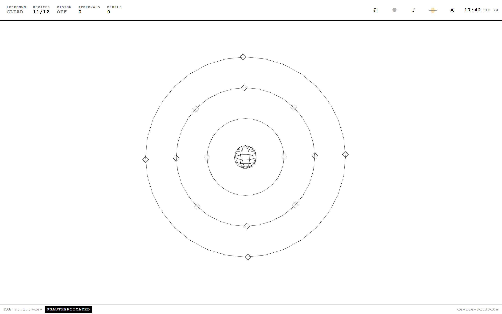
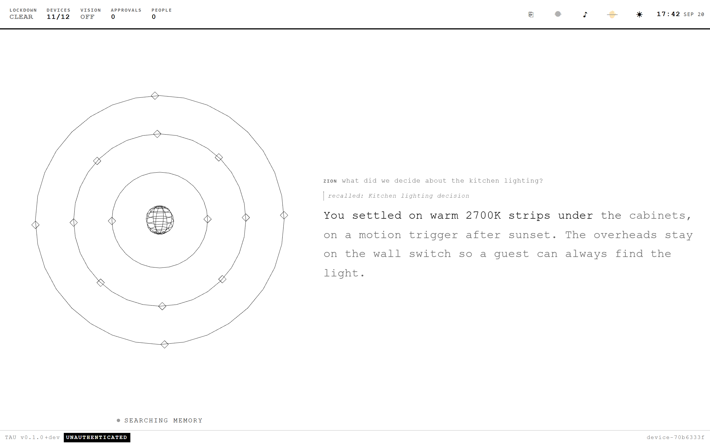
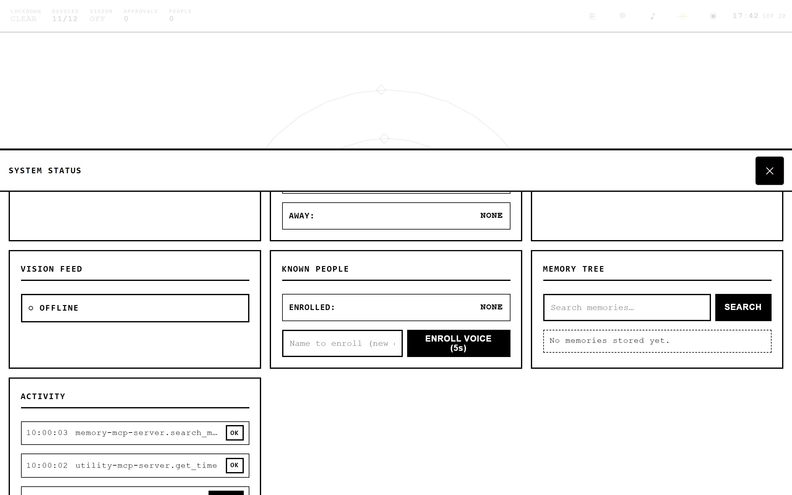
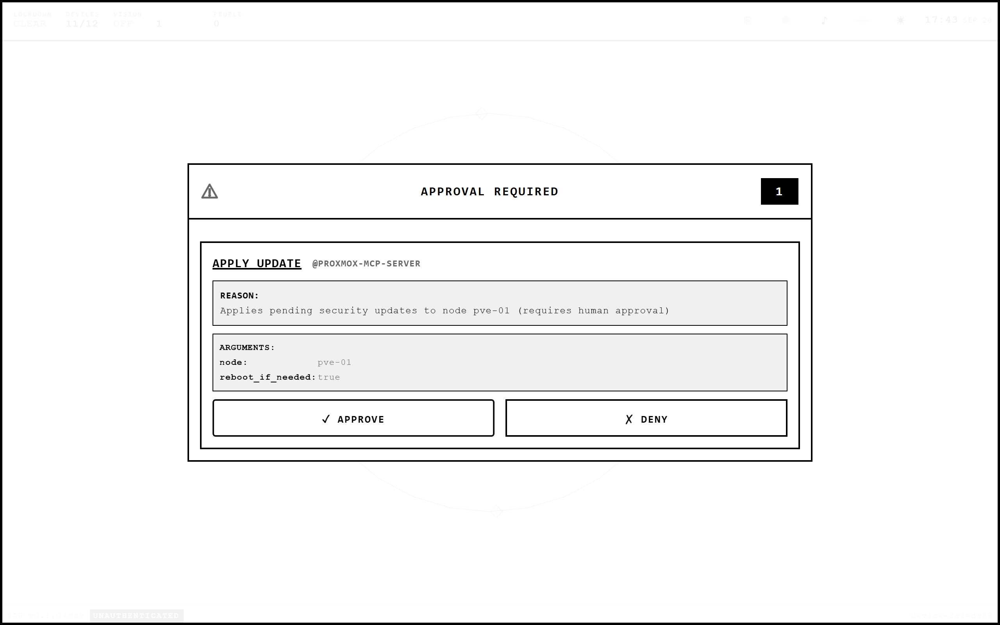
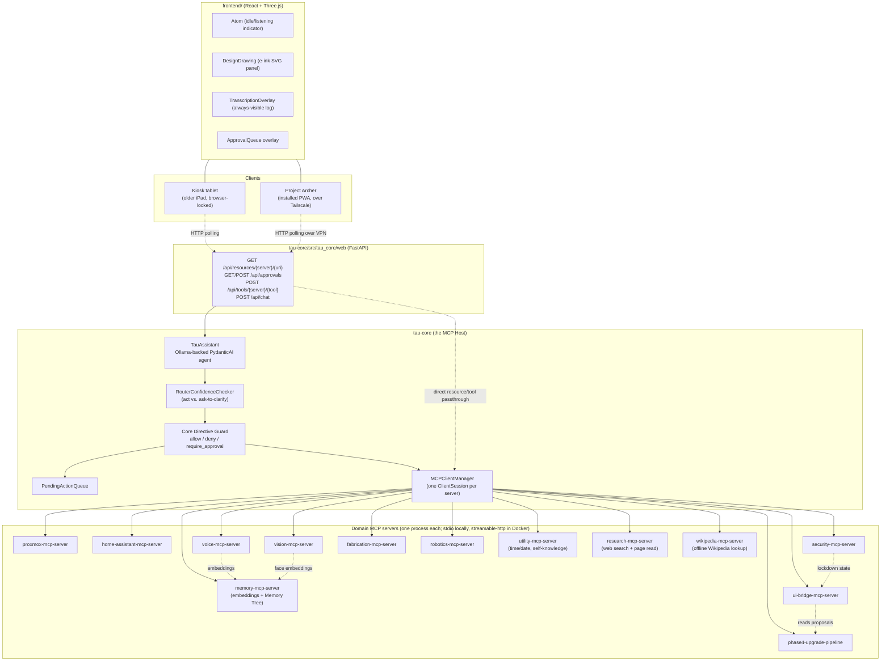
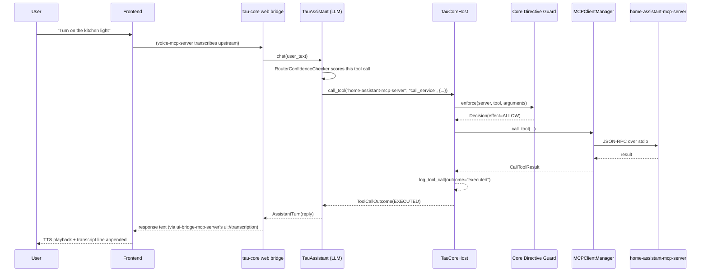
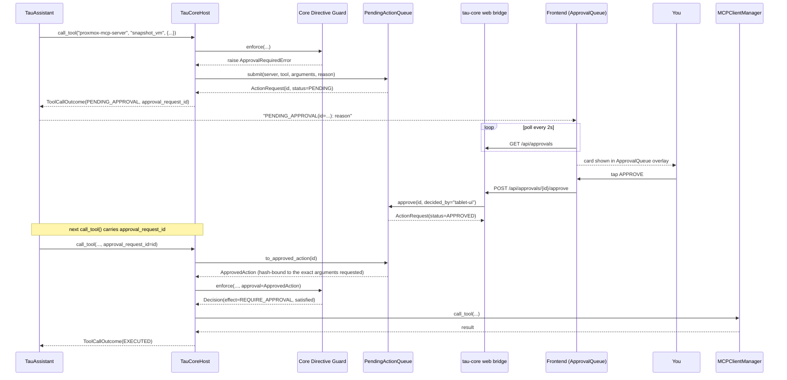
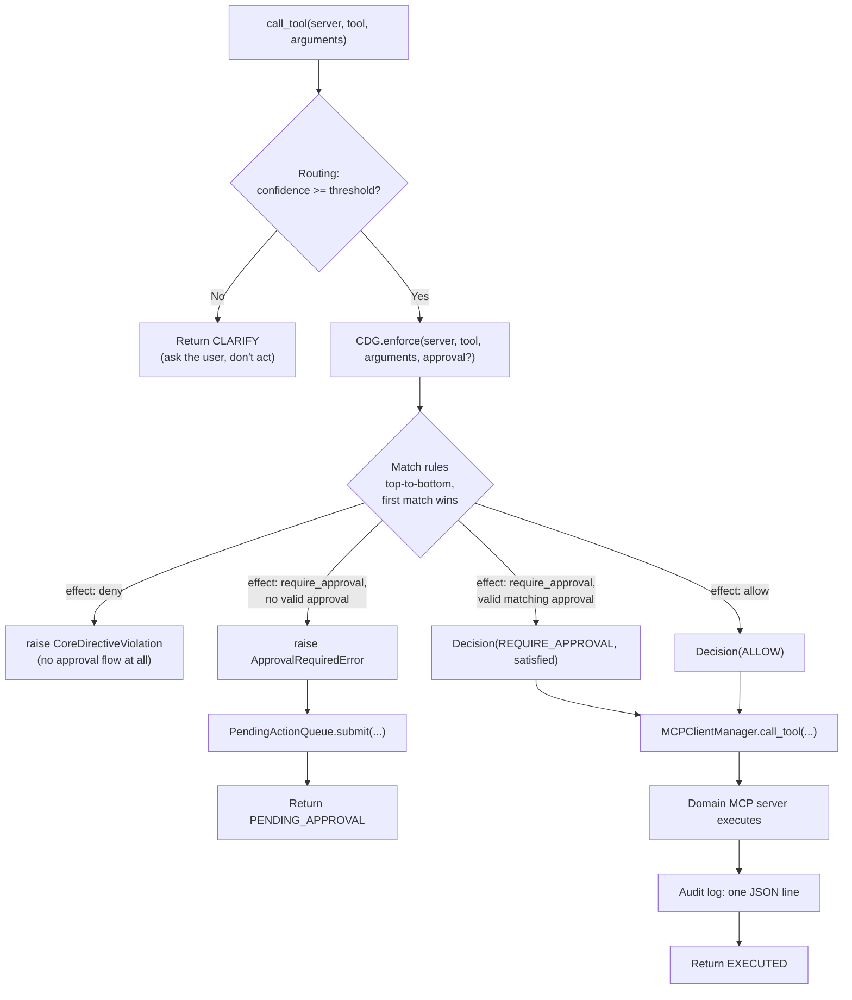
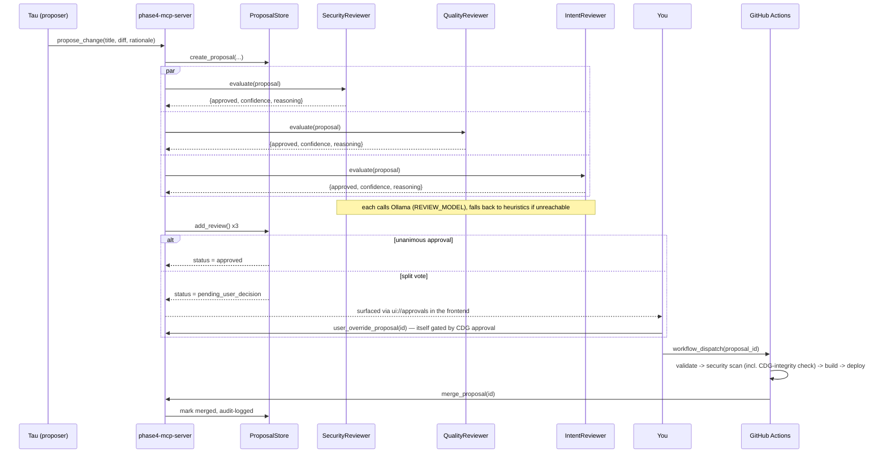

# tau-kai — Project Tau

A self-hosted, Proxmox-native home AI system, architected entirely on the **Model Context
Protocol (MCP)**. Every capability (infrastructure control, IoT, cameras, voice, 3D printing,
drone patrol, web research, self-upgrade review) is a separate, independently-deployable MCP
server; a single
**Core Directive Guard** sits between Tau's LLM and every one of them, so no tool call —
human-issued or model-issued — can bypass approval policy.

See [`project-tau-plan.md`](project-tau-plan.md) for the full build plan, phase-by-phase status,
and design rationale. This README is the "how it actually works" reference: architecture,
request lifecycle, every tool in the system, and how to run it.

---

## Screenshots

Real screenshots of the kiosk UI, captured against the actual built app (mocked API data, no
LLM/GPU required to reproduce — see `packages/frontend/scripts/visual-check.mjs`).

<table>
<tr>
<td width="50%">

**Idle** — the default state


</td>
<td width="50%">

**A reply, with recall provenance**


</td>
</tr>
<tr>
<td width="50%">

**System Status drawer**


</td>
<td width="50%">

**Human-in-the-loop approval**


</td>
</tr>
</table>

---

## 1. Core concepts

| Term | Meaning in this repo |
|---|---|
| **MCP Host** | `tau-core` — holds the LLM session, decides which tools to call, owns the Core Directive Guard. There is exactly one host. |
| **MCP Server** | A standalone package (e.g. `proxmox-mcp-server`) exposing a scoped set of **Tools** (actions) and **Resources** (readable state) over stdio. Independently deployable, independently killable, does not depend on `tau-core` or on any other domain server. |
| **Core Directive Guard (CDG)** | Deterministic middleware (`tau-core/src/tau_core/cdg/`) that every tool call passes through, regardless of whether the call originated from the LLM or from the web bridge. Not a system prompt — infrastructure the model cannot argue its way around. |
| **Approval Queue** | `tau_core.approval.PendingActionQueue` — a generic human-sign-off primitive. Any tool call the CDG marks `require_approval` lands here instead of executing; a human approves or denies it, bound to the exact server/tool/argument-hash it was requested for. |
| **Web Bridge** | `tau_core.web` — the only network-facing surface of `tau-core`. Everything the frontend does goes through it; every write still flows through `TauCoreHost.call_tool`, so the browser gets no privilege the LLM doesn't also have to earn. |

---

## 2. Architecture



Everything under "Domain MCP servers" is a standalone Python package with its own
`pyproject.toml`, its own `.venv`, its own test suite — none of them import from `tau-core` or
from each other. `tau-core` is the only thing that knows all of them exist, via
[`tau-core/config/servers.yaml`](packages/tau-core/config/servers.yaml) (or
[`servers.docker.yaml`](packages/tau-core/config/servers.docker.yaml) under Docker). There are
**thirteen** domain servers pictured above (a third-party, non-Docker-compose one,
`openscad-mcp-server`, is registered in `servers.yaml` too but not pictured here since it isn't
part of this repo or the compose stack).

---

## 3. Request lifecycle

### 3.1 A normal tool call (allowed, no approval needed)



Every call — allowed or not — writes one JSON line to the audit log
(`tau_core.logging_setup.log_tool_call`) before returning. That line is the "every tool call is
a logged, typed, reviewable event" property the whole design is built around.

### 3.2 A call requiring approval



The approval is bound to an `arguments_hash` (`tau_core.hashing.hash_arguments`) — approving
`snapshot_vm(vmid=101)` does not authorize `snapshot_vm(vmid=999)`. See
`tau-core/tests/test_cdg.py::test_approval_token_bound_to_exact_arguments`.

### 3.3 CDG rule evaluation



Rules live in [`tau-core/config/cdg_rules.yaml`](packages/tau-core/config/cdg_rules.yaml), evaluated
top-to-bottom by `fnmatch`-style glob on `server`/`tool`. **Order matters** — several servers
(`security-mcp-server`, `robotics-mcp-server`) have a specific `allow` rule for one tool
(`enter_lockdown`, `emergency_stop`) ordered *before* a blanket `require_approval` rule for
everything else on that server, so the fail-safe action is never gated behind the same
approval round-trip as the actions it exists to interrupt. `default_effect: allow` — a domain
server with no rules at all is unrestricted by default, which is why every write-capable tool
in this repo has an explicit rule (verified per-server in each package's tests against the real
repo config, not just unit tests against synthetic rulesets).

### 3.4 Phase 4: governed self-upgrade



Nothing in this pipeline can touch the CDG ruleset itself: `SecurityReviewer` hard-fails any
diff containing `CDG`/`cdg_rules`, and `no-cdg-self-modification` in `cdg_rules.yaml` is a flat
`deny` with no approval path at all — edits to that file are manual and out-of-band, by design.

---

## 4. Full tool & resource inventory

Generated against the actual `server.py` source (not documentation) — see each package's own
README for parameter-level detail and manual smoke-test instructions.

### proxmox-mcp-server
| Tool | Read-only? | Notes |
|---|---|---|
| `list_vms()` | ✅ | |
| `get_vm_status(vmid)` | ✅ | |
| `check_cve_advisories()` | ✅ | stub — no real NVD integration yet |
| `snapshot_vm(vmid, snapshot_name)` | Requires approval | |
| `create_lxc(node, vmid, hostname, template)` | Requires approval | |
| `restart_service(node, service)` | Requires approval | |
| `apply_update(node)` | Requires approval | |

### home-assistant-mcp-server
| Tool | Read-only? | Notes |
|---|---|---|
| `list_devices()` | ✅ | |
| `get_entity_state(entity_id)` | ✅ | |
| `call_service(domain, service, entity_id, data?)` | Mutates, no approval | refuses `lock`/`alarm_control_panel`/`cover` domains |
| `call_security_service(domain, service, entity_id, data?)` | Requires approval | the domains `call_service` refuses land here instead |

### voice-mcp-server
| Tool | Read-only? | Notes |
|---|---|---|
| `speak(text)` | ✅ (external side effect, no stored state) | Piper TTS, returns base64 WAV |
| `transcribe(audio_base64, filename?)` | ✅ | Whisper STT |
| `identify_speaker(audio_base64, threshold?)` | ✅ | computes embedding, hands to `memory-mcp-server.match_voice` |
| `enroll_voiceprint(person_id, audio_base64)` | Requires approval | computes embedding, hands to `memory-mcp-server.store_voice` |
| `detect_wake_word(audio_base64)` | ✅ | on-device openWakeWord over a short window |
| `list_wake_words()` | ✅ | backs the Admin Dashboard's WAKE WORD picker |
| `set_wake_word(wake_id)` | Requires approval | changes what every device listens for |
| `list_voices()` | ✅ | backs the VOICE picker; flags voices with no model downloaded |
| `set_voice(voice_id)` | Requires approval | changes how Tau sounds on every device |

### memory-mcp-server
| Tool | Read-only? | Notes |
|---|---|---|
| `match_face(embedding, top_k?)` | ✅ | |
| `match_voice(embedding, top_k?)` | ✅ | |
| `get_person_profile(person_id)` | ✅ | |
| `list_people()` | ✅ | every known person + face/voice sample counts |
| `search_memory(query, limit?)` | ✅ | Memory Tree keyword search |
| `get_memory_tree(root_id?)` | ✅ | nested JSON |
| `store_face(person_id, embedding)` | Requires approval | |
| `store_voice(person_id, embedding)` | Requires approval | |
| `set_access_level(person_id, access_level)` | Requires approval | |
| `set_person_portrait(person_id, svg?, ascii_art?)` | Mutates, no approval | caches e-ink portrait for the recognition card |
| `store_memory(title, content, parent_id?, tags?)` | Requires approval | Memory Tree node creation |
| `reinforce_memory(node_id)` | Mutates, no approval | only adjusts an existing node's score |

### vision-mcp-server
| Tool | Read-only? | Notes |
|---|---|---|
| `get_snapshot()` | ✅ | |
| `describe_scene(snapshot_b64?)` | ✅ | stub: brightness/edges/colors today |
| `detect_faces(snapshot_b64?)` | ✅ | returns embeddings ready for `store_face` |
| `track_object(object_type, snapshot_b64?)` | ✅ | placeholder — currently returns detected faces |
| `ptz_pan(degrees)` / `ptz_tilt(degrees)` / `ptz_zoom(factor)` | Requires approval | physical camera actuation |

### security-mcp-server
| Tool | Read-only? | Notes |
|---|---|---|
| `get_intrusion_status()` | ✅ | |
| `enter_lockdown(reason)` | Mutates, no approval | fail-safe direction |
| `log_incident(incident_type, description)` | Mutates, no approval | |
| `exit_lockdown(approval_token)` | Requires approval + valid token | |

### fabrication-mcp-server
| Tool | Read-only? | Notes |
|---|---|---|
| `get_printer_status()` | ✅ | |
| `pause_print()` / `resume_print()` | Mutates, no approval | reversible |
| `submit_print_job(gcode_path, bed_temp?, nozzle_temp?)` | Requires approval | resource commitment |
| `cancel_print()` | Requires approval | waste mitigation |

### robotics-mcp-server
| Tool | Read-only? | Notes |
|---|---|---|
| `get_telemetry()` | ✅ | |
| `list_patrol_routes()` | ✅ | pre-approved routes only |
| `emergency_stop()` | Mutates, no approval | fail-safe direction |
| `patrol_route(route_name)` | Requires approval | name-only, no raw waypoints accepted anywhere in this package |
| `return_to_home()` | Requires approval | |

### ui-bridge-mcp-server
Resources (all read-only): `ui://state`, `ui://transcription`, `ui://security`, `ui://devices`,
`ui://vision`, `ui://design`, `ui://recognition`, `ui://approvals`.

| Tool | Notes |
|---|---|
| `update_transcription(text, is_active?, speaker?)` | appends to transcript history, not overwrite |
| `update_security_state(...)` / `update_devices_state(...)` / `update_vision_state(...)` | aggregate-state writers |
| `update_design_state(title, description, svg?, ascii_art?)` | requires at least one of svg/ascii_art |
| `clear_design_state()` | |
| `update_recognition_state(person_id, role, svg?, ascii_art?)` | "USER RECOGNIZED" e-ink portrait card; requires at least one of svg/ascii_art |
| `clear_recognition_state()` | frontend auto-dismisses on its own after a few seconds; this is for the early-exit case |
| `refresh_approval_queue()` | reloads from Phase 4's proposal store |
| `mark_approval_viewed(proposal_id)` | **known gap**: doesn't persist anything yet, see Section 6 |

### phase4-upgrade-pipeline
| Tool | Read-only? | Notes |
|---|---|---|
| `get_proposal(id)` / `list_proposals(status?)` | ✅ | |
| `propose_change(title, diff, rationale)` | Mutates | triggers 3 automatic reviews |
| `merge_proposal(id)` / `reject_proposal(id, reason?)` | Mutates | |
| `user_override_proposal(id, override_reason?)` | Requires approval | bypasses unanimous-review requirement |

### utility-mcp-server (Phase 6)
Basic primitives + self-knowledge, so Tau never *guesses* the time or what hardware/tools it has.
Resource: `tau://identity`.

| Tool | Read-only? | Notes |
|---|---|---|
| `get_time()` / `get_date()` | ✅ | honours `TAU_TIMEZONE` |
| `get_system_status()` | ✅ | model + CPU + uptime (GPU/VRAM probe degrades to unavailable in the slim image) |
| `describe_capabilities()` | ✅ | Tau's own server/tool inventory; falls back to a built-in catalog when the registry file isn't mounted |

### research-mcp-server (Phase 8)
The only server that brings **untrusted outside text** into Tau. Fetched text is wrapped in an
explicit untrusted-content marker; `MAIN_SYSTEM_PROMPT` tells the model that content is data to
summarise, never instructions. The intended use is a scoped sub-agent
(`spawn_subagent(task, servers=["research-mcp-server"])`). Resource: `research://backend`.

| Tool | Read-only? | Notes |
|---|---|---|
| `search_web(query, max_results?)` | ✅ | via self-hosted SearxNG (`SEARXNG_URL`) |
| `fetch_page(url)` | ✅ (outbound) | SSRF-guarded (`safety.py`); still an audited-but-open exfiltration channel — a domain allowlist is the only real fix. **Do not register this server in a deployment holding secrets it can't risk.** |

### wikipedia-mcp-server (added 2026-08-10)
Offline-first encyclopedia lookups, backed by a self-hosted Kiwix server serving one Wikipedia
ZIM snapshot (currently the smallest tier, `wikipedia_en_top_nopic` — see
`infra/kiwix/zim-variants.md`). Deliberately has **no online-fetch tool of its own** — a "not
found in the offline snapshot" response names `research-mcp-server` as the next step instead of
duplicating its SSRF-hardened fetch logic. Reuses `research-mcp-server`'s
`<<<UNTRUSTED_WEB_CONTENT>>>` framing rather than a new marker (see the package README's threat
model section for why). Resource: `wikipedia://backend`.

| Tool | Read-only? | Notes |
|---|---|---|
| `search_wikipedia(query, max_results?)` | ✅ | via a self-hosted Kiwix server (`KIWIX_URL`/`KIWIX_ZIM_NAME`) |
| `get_wikipedia_article(title)` | ✅ | fetches and extracts one article's text from the local snapshot |

---

## 5. Repository layout

**Restructured 2026-07-18** (Phase 10.5): every installable package — tau-core, the thirteen
domain servers, and the frontend — moved from the repo root into `packages/`, so root holds only
cross-cutting things (docs, `docker/`, `infra/`, `scripts/`, the two compose files) and
`packages/` holds only independently-buildable units. Nothing about how each package installs or
runs changed — sibling-relative commands (`pip install -e ../other-package`, `cd ../frontend`)
still work exactly the same, since every package moved together and stayed siblings; only paths
written *from the repo root* (compose build contexts, CI job paths, the quick-start `cd`s below)
needed updating.

```
tau-kai/
├── packages/
│   ├── tau-core/                    Phase 1 — the MCP Host
│   │   ├── src/tau_core/
│   │   │   ├── cdg/                 Core Directive Guard: rules.py, guard.py, exceptions.py
│   │   │   ├── approval/             PendingActionQueue
│   │   │   ├── mcp_client/           MCPClientManager (stdio + Streamable HTTP transports)
│   │   │   ├── session/               rolling conversation state
│   │   │   ├── routing/               confidence-threshold act-vs-clarify policy
│   │   │   ├── llm/                   TauAssistant (PydanticAI + Ollama), toolset builder
│   │   │   ├── web/                   FastAPI bridge — the ONLY network surface tau-core has
│   │   │   ├── hardware.py            GPU/CPU/RAM probe + model-tier recommendation (Phase 6.A/10.5)
│   │   │   └── host.py                TauCoreHost.call_tool: the one path everything goes through
│   │   ├── config/                   servers.yaml (registry) + cdg_rules.yaml (policy)
│   │   └── examples/                 echo/dangerous stdio servers used by the test suite
│   │
│   ├── proxmox-mcp-server/           Phase 2.1 — VM/LXC control
│   ├── home-assistant-mcp-server/    Phase 2.2 — IoT
│   ├── voice-mcp-server/             Phase 2.3 — Piper TTS + Whisper STT + voiceprint
│   ├── memory-mcp-server/            Phase 2.4 — face/voice embeddings + Memory Tree (2.8)
│   ├── vision-mcp-server/            Phase 2.5 — cameras, face detection, PTZ
│   ├── security-mcp-server/          Phase 2.6 — lockdown & incident log
│   ├── fabrication-mcp-server/       Phase 2.7 — 3D printers (OctoPrint/Moonraker)
│   ├── ui-bridge-mcp-server/         Phase 3 — state aggregation for the frontend
│   ├── frontend/                     Phase 3 — React + Three.js UI, also a Project Archer PWA
│   ├── phase4-upgrade-pipeline/      Phase 4 — governed self-upgrade (propose/review/merge)
│   ├── robotics-mcp-server/          Phase 5 — drone patrol (robot dog deferred)
│   ├── utility-mcp-server/           Phase 6 — time/date, system status, self-knowledge
│   ├── research-mcp-server/          Phase 8 — web search + page read (untrusted-input boundary)
│   └── wikipedia-mcp-server/         added 2026-08-10 — offline Wikipedia lookup (Kiwix-backed)
│
├── docker/                       Dockerfiles (generic mcp-server image + per-server one-offs)
├── docker-compose.yml            whole-system dev/test stack (verified live 2026-07-16)
├── docker-compose.gpu.yml        GPU overlay (Ollama + faster-whisper on NVIDIA)
├── infra/                        Phase 0 — k3s/Vault/observability/registry manifests (not applied)
└── project-tau-plan.md           the full build plan; each phase's own status lives there
```

Every domain-server directory follows the same internal shape: `src/<package>/server.py`
(FastMCP tool/resource definitions) + one or more `*_store.py`/`*_client.py` modules (the
actual logic, kept separate so it's unit-testable without spinning up an MCP session) +
`tests/` (offline, mocked externals) + its own `README.md` + its own `.venv`.

---

## 6. Known gaps (kept honest on purpose)

Documentation drift is worse than an admitted gap, so this section gets updated whenever one of
these closes — check `project-tau-plan.md` section 10 for the fuller, phase-by-phase version.

- **`mark_approval_viewed`** (ui-bridge-mcp-server) doesn't persist a "viewed" state anywhere —
  it echoes the id back and does nothing else. Harmless (it's a UI acknowledgment, not a
  security control) but not yet real.
- ~~**Memory Tree Engine has no automatic consumer.**~~ Fixed 2026-07-11:
  `tau_core.session.MemoryTreeBackend` recalls Memory Tree context on every chat turn (through
  `host.call_tool`, so CDG/audit apply; degrades to no-recall if the server is down).
  Auto-*storing* is still deliberately absent — `store_memory` requires human approval.
- **`check_cve_advisories`** (proxmox-mcp-server) is a stub — no real NVD API polling.
- **Hardware-in-the-loop testing is entirely absent.** Every domain server is tested against
  mocks; none has been run against a real Proxmox cluster, Home Assistant instance, drone
  flight controller, or 3D printer yet.
- **Phase 0 infrastructure (Vault, k3s, VLANs, Grafana/Loki/Prometheus, Tailscale) is not
  deployed anywhere in this repo** — it's deployment work, not code, and every domain server
  was deliberately built to be testable offline so this wouldn't block anything else.
- **Project Archer** is a PWA wrapper around the same frontend, not the native "thinned-down
  MCP Host" the original plan described — see `frontend/README.md`'s own section on this.
- **LLM tool-selection reliability is the system's real bottleneck**, and it has now been
  reproduced live rather than merely suspected. Against a live Ollama on the Docker stack
  (2026-07-16) the configured `qwen2.5:7b-instruct` answers simple questions but **drifts and
  leaks tool-call JSON into prose** and misses plain tool calls ("turn on the kitchen light" →
  no call) — the pipeline, CDG, audit, and approval flow are all sound; the *model* can't yet
  reliably drive them. The fix is model-side: a GPU + a stronger/tool-use-specialised model, and
  retuning the Phase 6.A tier map. See `project-tau-plan.md` §10.0 (the highest-leverage open
  item) and section 10's "LLM model fit notes" for the full matrix and models to evaluate next.

---

## 7. Getting started

> **Deploying the whole stack with Docker** (bring-up, GPU, model, LAN/phone access, remote access
> + phone voice over Tailscale HTTPS, SSH, security): see **[`DEPLOYMENT.md`](DEPLOYMENT.md)**. The
> notes below are for hacking on an individual package from source.

Each package is independently installable — there's no monorepo build tool, just one `.venv`
per package plus `pytest`. Every package's own test suite runs standalone with nothing else
installed; that part genuinely has no prerequisites.

Running the *assembled system* is a different story, and worth being precise about:
`tau_core.web.create_app()` calls `MCPClientManager.connect_all()` on startup, which loops over
**every** server listed in `packages/tau-core/config/servers.yaml` and spawns it as a subprocess
(`python -m <package>.server`) — and `connect_all()` is not fault-tolerant: if any one of those
ten `python -m` imports fails (because that package was never `pip install -e`'d into
`tau-core`'s own `.venv`), the whole bridge fails to start, not just that one server. This is
annoying for a from-scratch checkout and is exactly the kind of thing that should eventually
become a single setup script — it isn't one yet (unless you use Docker Compose instead — see
7.1 below, which sidesteps this entirely since each domain server runs in its own container
and tau-core reaches it over the network rather than `pip install -e`ing it into a shared
`.venv`).

**The critical step people miss: activate `tau-core`'s venv before running any `pip install -e`
below.** Running `pip install -e ../proxmox-mcp-server` from a plain shell installs into
whatever `pip` your `PATH` happens to resolve to — some global/system Python, not this repo's
venv — which is a different (and on Windows, sometimes broken-launcher) problem entirely, and
does nothing to satisfy what `packages/tau-core/config/servers.yaml` needs. If you see `Fatal error in
launcher: Unable to create process...`, that's this: you're not in the venv, you're hitting a
global `pip.exe` whose embedded path to `python.exe` no longer resolves on your machine.

### Windows (PowerShell)

PowerShell 5.1 does not support `&&` as a statement separator — use `;`, or put each command on
its own line as below.

```powershell
cd packages\tau-core
.\.venv\Scripts\Activate.ps1
# prompt should now be prefixed with (.venv) - only THEN run these:
pip install -e ..\proxmox-mcp-server
pip install -e ..\home-assistant-mcp-server
pip install -e ..\voice-mcp-server
pip install -e ..\memory-mcp-server
pip install -e ..\vision-mcp-server
pip install -e ..\security-mcp-server
pip install -e ..\fabrication-mcp-server
pip install -e ..\ui-bridge-mcp-server
pip install -e ..\robotics-mcp-server
pip install -e ..\phase4-upgrade-pipeline

python -m tau_core.web    # binds 127.0.0.1:8000 by default - leave this running
# set $env:TAU_WEB_HOST="0.0.0.0" first if a tablet on the LAN needs to reach this directly
# (not through the frontend dev server above) - see tau_core/web/__main__.py's docstring.

# in a second terminal:
cd packages\frontend
npm install
npm run dev                # http://localhost:3000
```

### macOS/Linux (bash)

```bash
cd packages/tau-core
source .venv/bin/activate
for pkg in proxmox-mcp-server home-assistant-mcp-server voice-mcp-server memory-mcp-server \
           vision-mcp-server security-mcp-server fabrication-mcp-server ui-bridge-mcp-server \
           robotics-mcp-server phase4-upgrade-pipeline; do
  pip install -e "../$pkg"
done

python -m tau_core.web &   # binds 127.0.0.1:8000 by default
# TAU_WEB_HOST=0.0.0.0 python -m tau_core.web & instead if a tablet on the LAN needs to reach
# this directly (not through the frontend dev server above).

cd ../frontend && npm install && npm run dev   # http://localhost:3000
```

Once connected, every domain server degrades gracefully without its real external dependency
(mock-friendly clients, stub responses) rather than crashing — see each package's own README
for exactly what "no real Proxmox/HA/printer/drone available" looks like for that server.

### 7.1 Docker (whole system, one container per server)

> **Verified live 2026-07-16.** The full 18-service stack (tau-core + 12 domain servers +
> frontend + Ollama/whisper/piper/searxng) has now been built and brought up against a real
> Docker daemon end-to-end: all containers reach `healthy`, `depends_on: service_healthy` gates
> tau-core until every server listens, `/api/health` reports `ok` with 12/12 connected, a real
> process crash is auto-restarted (~9s), and a full governed chat turn completes (warm 7b, ~42s
> on CPU). Two bugs were found and fixed *only* because it was actually run — see
> `project-tau-plan.md` §10.2 #9.

`docker-compose.yml` at the repo root builds and runs tau-core, all thirteen domain servers, the
frontend, **and the model/voice/knowledge backends the system depends on — Ollama (LLM),
faster-whisper (STT), Piper (TTS), SearxNG (self-hosted web search for research-mcp-server), and
Kiwix (self-hosted offline Wikipedia for wikipedia-mcp-server)** — as separate
containers, so the whole system runs inside Docker with no host-side Ollama or hand-launched
whisper process. This is possible because `tau_core.mcp_client`
already supports
`streamable_http` alongside `stdio` (`tau-core/src/tau_core/mcp_client/config.py`) — in Docker,
every domain server runs FastMCP's `streamable-http` transport instead of being spawned as a
local subprocess, so tau-core reaches it over the compose network instead of needing it
`pip install -e`'d into the same `.venv`. Each server's `if __name__ == "__main__":` block picks
the transport from `MCP_TRANSPORT` (default `stdio`, unchanged from before); `docker-compose.yml`
sets it to `streamable-http` for every container. `tau-core/config/servers.docker.yaml` is the
streamable_http counterpart of `servers.yaml`, wired in via `TAU_SERVERS_CONFIG_PATH`.

```bash
# once per package that needs real credentials (proxmox, home-assistant, security, ...):
cp packages/proxmox-mcp-server/.env.example packages/proxmox-mcp-server/.env   # then fill in real values
# every env_file in docker-compose.yml is optional, so `docker compose up` also works
# out of the box with no .env files at all — features gated behind *_ENABLED flags just
# stay off until you opt in.

docker compose up --build
# tau-core:  http://localhost:8000
# frontend:  http://localhost:3000
# ollama:    http://localhost:11434  (no models baked in - pull once the stack is up)

# Ollama ships no models in the image; pull the one tau-core/.env expects. The shipped .env
# uses qwen2.5:7b-instruct (fits ~8 GB); infra/ollama/models.md recommends qwen2.5:14b-instruct
# where you have the VRAM. Pull whatever OLLAMA_MODEL/OLLAMA_ROUTER_MODEL in packages/tau-core/.env name:
docker compose exec ollama ollama pull qwen2.5:7b-instruct
# (infra/ollama/models.md explains the model-fit trade-offs; the 7b is a known bottleneck —
#  project-tau-plan.md §10.0 — so a GPU + a stronger tool-use model is the intended upgrade)
```

Until a model is pulled, `POST /api/chat` returns 503 (the rest of the stack — health, tools,
approvals, resources — works without one). On CPU a full turn is slow (router does median-of-3
sampling, so a turn is 4 sequential inferences); the GPU overlay below is the real fix.

#### GPU acceleration

`docker-compose.gpu.yml` is an overlay that puts the two heavy workloads on an NVIDIA GPU —
Ollama (the 14b main model, by far the biggest consumer) and faster-whisper (STT). Layer it on:

```bash
docker compose -f docker-compose.yml -f docker-compose.gpu.yml up --build -d
docker compose exec ollama nvidia-smi   # confirm the GPU is visible inside the container
```

- **Linux** needs the [nvidia-container-toolkit](https://docs.nvidia.com/datacenter/cloud-native/container-toolkit/)
  installed and configured. **Windows** needs Docker Desktop on the WSL2 backend with the NVIDIA
  driver's WSL CUDA support — check with `wsl -d docker-desktop nvidia-smi` first.
- Ollama gets the GPU out of the box (its official image bundles the CUDA runtime). Whisper is
  rebuilt on a CUDA+cuDNN base and switched to `device=cuda`/`float16` (and a bigger default
  model, since GPU makes it affordable).
- The speaker-ID embedding (voice-mcp-server) and insightface (vision-mcp-server) deliberately
  stay on CPU — both are small enough that GPU isn't worth a CUDA-wheel image rebuild. The knobs
  exist (`SPKREC_DEVICE=cuda`) if you later decide otherwise; see the header of
  `docker-compose.gpu.yml` for exactly what each service would need.

Dockerfiles live in `docker/`: `mcp-server.Dockerfile` is a generic image for the ten src-layout
domain servers (parameterized by a `MODULE` build arg — **every generic-image service in
`docker-compose.yml` must pass `args: MODULE: <package>`;** a service that omits it builds an
image that runs `python -m .server` and crash-loops, which is exactly the bug the live bring-up
caught on research-mcp-server). `vision.Dockerfile`, `phase4.Dockerfile`, `tau-core.Dockerfile`,
`whisper.Dockerfile`, and `frontend.Dockerfile` are one-offs where the generic image doesn't fit
(vision needs opencv's system libs, phase4 has a flat-file layout with no `src/`, tau-core is the
FastAPI bridge, whisper is the faster-whisper STT service, frontend is Vite + nginx).

Two things worth knowing before you rely on this:

- **vision-mcp-server's camera doesn't work through Docker Desktop on Windows/Mac at all**, and
  needs an explicit `/dev/videoN` passthrough (commented out in `docker-compose.yml`) even on
  Linux. `get_snapshot`/`detect_faces`/`describe_scene`/`track_object` will error at call time
  without it — `ptz_pan/tilt/zoom` are unaffected (pure HTTP to `PTZ_URL`, no camera involved).
  Run vision-mcp-server natively (see its own README) when you actually need the camera.
- **ui-bridge-mcp-server reads phase4's `proposals.json` straight off disk**, not over MCP — the
  two containers share a `phase4-data` named volume so this still works; a real fix would be
  ui-bridge calling phase4-mcp-server as an MCP client instead, which hasn't been done here.

This compose file is for local dev/test. For the actual home-lab deployment, build these same
images, push them to the registry already provisioned at `infra/k3s/registry/`, and add k3s
manifests per service (mirroring `infra/k3s/voice/`'s existing pattern) — that part isn't done.

### 7.2 Deploying onto a server

The same `docker-compose.yml` is the quickest way to stand Tau up on a real box (a home-lab
VM/LXC, a NUC, a small server). The steps are the compose steps above, run *on the server*:

```bash
# on the server (Linux, Docker Engine + compose plugin installed):
git clone <this-repo> tau-kai && cd tau-kai
# optional: cp packages/<pkg>/.env.example packages/<pkg>/.env for any server needing real credentials
docker compose up -d --build                     # -d so it keeps running after you log out
docker compose exec ollama ollama pull qwen2.5:7b-instruct   # or the 14b if you have the VRAM
curl -s http://127.0.0.1:8000/api/health         # expect status "ok", 12/12 connected
```

Then make it durable and, above all, **not exposed**:

- **Survive reboots.** `restart: unless-stopped` is already on every service, so enable Docker at
  boot (`sudo systemctl enable docker`) and the whole stack comes back on its own.
- **Do NOT expose ports 8000/3000 to the public internet.** In Docker, `TAU_WEB_HOST` is set
  explicitly to `0.0.0.0` *inside the container* (a container binding its own loopback would be
  unreachable through the `8000:8000` port mapping at all) with `allow_origins=["*"]`, and there
  is still **no authentication** on `/api/chat`, the tool passthrough, or approve/deny
  (`TAU_REQUIRE_VOICE_APPROVAL` defaults `false`). This is by design for a trusted-LAN kiosk, and
  it is a wide-open remote-code-adjacent surface anywhere else — see `project-tau-plan.md` §10.1
  #4. Phase 7 Tier 1 #9 landed the code-level minimums (binding `127.0.0.1` by default *outside*
  Docker, sanitizing raw exception text out of HTTP error responses, and a per-client rate limit
  on `/api/chat`/`/api/voice/*`), but none of that is authentication — anyone who can reach the
  port can still chat, call tools, and approve/deny. `research-mcp-server`'s `fetch_page` is
  additionally an outbound channel reachable through that unauthenticated passthrough. Put the
  stack on a private network (Tailscale/WireGuard/VPN) or behind a reverse proxy that terminates
  TLS and enforces auth, and bind the published ports to `127.0.0.1` in an override if a proxy is
  doing the exposing. Treat "reachable from the internet" as "compromised" until real
  authentication lands.
- **Device-token enforcement (`TAU_REQUIRE_DEVICE_TOKEN`, Phase 27.A) is ON by default as of
  Phase 48 (2026-09-16).** It was off from 2026-08-19 only long enough to soak in real use first
  (§8.28 step 6) - the mechanism itself hasn't changed, only the default. **Approve every real
  device BEFORE redeploying onto this default**, or they lock out immediately, kiosk included:
  1. `GET /api/devices` (via the admin dashboard, or `curl` with an admin voice token /
     `X-Tau-Admin-Service-Token`) and confirm every device you actually use - every kiosk tablet,
     the desktop client, and (if you run `tau-admin-server`) the synthetic `tau-admin-server`
     device its drafts promote/discard proxy authenticates as - shows `status: "approved"`.
     `/api/chat` is the obvious one to check; the admin-server device is easy to miss because it
     never calls `/api/chat` itself.
  2. For each `pending` one that should keep working, approve it from the admin dashboard (or
     `tau-admin-server`'s `/api/admin/devices/{id}/approve`) and paste the one-time token into
     that device (`localStorage`/the Tauri keychain, depending on build) - `tau-admin-server`
     itself isn't a browser, so it reads its token from `TAU_ADMIN_TAU_CORE_DEVICE_TOKEN` in its
     own `.env` instead.
  3. Only then `git pull && docker compose up -d --build`. A device that shows up later unapproved
     is refused, not silently trusted - approve it the same way before it needs to work. Set
     `TAU_REQUIRE_DEVICE_TOKEN=false` in `tau-core/.env` to go back to the loud-but-open posture if
     you're not ready yet.
- **Size the box for the model.** The 7b needs ~6–8 GB free RAM resident; the 14b noticeably more.
  There are **no compose memory limits yet** (§10.2 #8), so on a small box Ollama can starve the
  rest — set `mem_limit`/`cpus` in an override, or keep the model small, until that's addressed.
- **GPU** (optional, and the real fix for chat latency): add the overlay, as in §7.1's GPU
  section — `docker compose -f docker-compose.yml -f docker-compose.gpu.yml up -d --build`.
- **Persistence & data.** Approvals, the audit trail, memory embeddings, and the draft vault live
  in named volumes. `docker compose down` keeps them; `docker compose down -v` **wipes** them.
  These volumes hold biometric and household data in plaintext today (encryption-at-rest is
  §10.2 #7, undone) — back them up and protect them accordingly.
- **Redeploy.** `git pull && docker compose up -d --build` rebuilds only what changed and
  recreates those containers; the volumes (and pending approvals) survive it.

For a multi-node / production home-lab, the k3s path (`infra/k3s/`) is the intended target rather
than compose — the registry, Vault, observability, and voice manifests are already there; the
per-domain-server manifests are the remaining work.

---

## 8. Adding an MCP server

Tau's extensibility model is deliberately "add a capability = stand up a new MCP server." There
are two flavours, and the governance posture differs.

### 8.1 A first-party server (one you write)

1. **Scaffold the package** under `packages/`, mirroring any existing one: `src/<package>/server.py`
   (FastMCP tool/resource definitions) + the real logic in separate `*_store.py`/`*_client.py`
   modules (so it's unit-testable without an MCP session) + `tests/` (offline, mocked externals) +
   its own `pyproject.toml` and `README.md`.
2. **Match the transport wiring exactly.** Construct FastMCP with host/port at construction time —
   `FastMCP(name, host=os.getenv("FASTMCP_HOST", "127.0.0.1"), port=int(os.getenv("FASTMCP_PORT",
   "8000")))` — and run `mcp.run(transport=os.getenv("MCP_TRANSPORT", "stdio"))`. Setting the host
   *after* construction leaves FastMCP's transport-security Host allowlist at its 127.0.0.1
   default and gets you a `421 Misdirected Request` from tau-core over the compose network (the
   research-mcp-server bug fixed 2026-07-16).
3. **Register it with the host** in both [`packages/tau-core/config/servers.yaml`](packages/tau-core/config/servers.yaml)
   (local stdio) and [`servers.docker.yaml`](packages/tau-core/config/servers.docker.yaml) (the
   `streamable_http` URL, `http://<service>:8000/mcp`).
4. **Write CDG rules** in [`cdg_rules.yaml`](packages/tau-core/config/cdg_rules.yaml). **This is not
   optional: `default_effect: allow`, so a server with no rules is completely unrestricted.**
   Every write-capable tool needs an explicit `require_approval` (or `deny`), and any fail-safe
   action gets an `allow` rule ordered *before* the blanket rule (§3.3). Add a per-server test
   asserting your rules against the real repo config, like the other servers do.
5. **Add it to `docker-compose.yml`.** For a standard src-layout server, reuse the generic image
   and **pass the module name**: `build: { context: ./packages/<package>, dockerfile:
   ../../docker/mcp-server.Dockerfile, args: { MODULE: <package> } }`, plus `<<: *mcp-server`
   (restart + healthcheck) and, if tau-core should
   wait for it, a `depends_on` entry under tau-core with `condition: service_healthy`. **Omitting
   the `MODULE` arg is the crash-loop bug from the live bring-up** — don't. Heavy system deps
   (opencv, torch) warrant a one-off Dockerfile instead.
6. **For local (non-Docker) runs**, `pip install -e ../<package>` into tau-core's venv (see §7).

### 8.2 A third-party / open-source server

**Yes — you can add open-source MCP servers, and the honest answer is "as long as you declare
them" is right, provided "declare" means more than writing down a name.** Architecturally a
third-party server is the same as a first-party one (register it, give it CDG rules, add it to
compose). The difference is you didn't write it, so declaring it must capture what makes it safe:

- **License.** Record the actual SPDX id per server. Permissive (MIT/Apache-2.0/BSD) is safe to
  vendor and ship; copyleft needs care, and **AGPL in particular can reach a networked service
  like Tau Core** — know which you're taking on.
- **Provenance + pin.** Record the source URL and a **pinned version or commit hash**, never
  "latest." An MCP server exposes *tools the model can invoke*, so an unpinned third party is a
  live supply-chain surface, not just a dependency.
- **Default-deny its tools.** Because `default_effect: allow`, a freshly registered third-party
  server runs **wide open** until you write rules. Give it explicit CDG rules — `require_approval`
  or `deny` for anything with a side effect — before it's ever connected, not after.
- **Untrusted I/O.** If it reads the outside world (web, email, arbitrary files), treat it like
  `research-mcp-server`: scope it to a sub-agent, wrap its output as untrusted data, and remember
  `fetch_page`-style tools are exfiltration channels a blocklist won't close — an allowlist will.

Make the declaration a real artifact, not a mental note: a `THIRD_PARTY_MCP.md` (or a section in
your gap-analysis doc) with one row per external server — **name, upstream URL, pinned
version/commit, SPDX license, tools exposed, permission tier**. That table is what a reviewer, an
auditor, or future-you actually needs, and it's the difference between "declared" and "declared
in a way that means something."

---

## 9. Testing philosophy

Every domain server is tested **fully offline** — mocked HTTP clients, `tmp_path`-backed
file/SQLite stores, in-memory Chroma. No package's test suite requires a live Proxmox cluster,
Home Assistant instance, camera, printer, or drone to pass. `tau-core`'s own tests go one level
further where it matters: `test_host_integration.py`, `test_web_server.py`, and
`test_mcp_client_manager.py` run against *real* MCP transport (the `echo`/`dangerous` example
servers in `tau-core/examples/`, spawned as actual subprocesses) rather than mocking the MCP
protocol itself, so the CDG-enforcement path is proven end-to-end, not just unit-tested against
synthetic rule sets. Current counts: **186 tau-core tests**, 32 research-mcp-server, plus each
remaining domain server's own suite (memory, ui-bridge, robotics, voice, vision, …) — see
`project-tau-plan.md`'s per-phase status blocks for exact figures as of each phase's build.
A real CI workflow (`.github/workflows/ci.yml`) now runs these on every push and PR, including a
CDG-integrity assertion that the guard still denies edits to its own ruleset.
